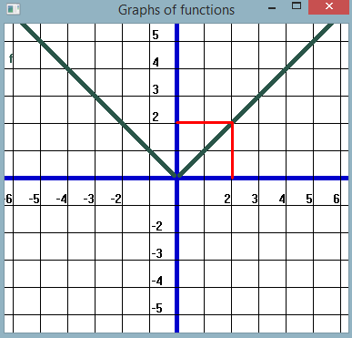
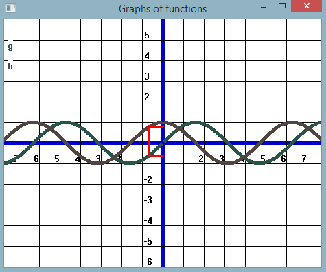

# About project
### Quality: **OK**
### Year of creation: 2019

## Scale of quality
**professional**
maintainable, scalable and performing -> well thought out architecture, clean structure, complete documentation

**prototyping**
maintainable and scalable to a certain extent -> rough architecture, clean structure, readable

**OK**
maintainable -> clean structure, readable

**hacky**
just good enough to run

# Function graphs
C-Program using the Win32-API which I wrote for fun and to practice the C language. It can draw 2D graphs of mathematical functions and can graphically mark function values for a given input.

